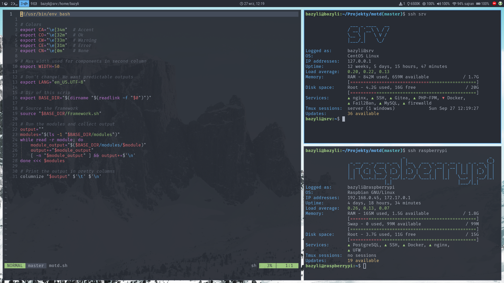

# Fancy MOTD
Fancy, colorful MOTD written in bash. Server status at a glance.



## Usage

### Running
Clone the repository
```shell
git clone https://github.com/bcyran/fancy-motd.git
./fancy-motd/motd.sh
```

Then run `motd.sh`
```shell
./fancy-motd/motd.sh
```

If you have the config at on other location just pass the location and run `motd.sh`
```shell
./fancy-motd/motd.sh config.sh
```

This runs all the scripts in `modules` directory in order, `run-parts` style, and formats the output.

### Running at login
One way to run it at each login is to add a line to `~/.profile` file (assuming you cloned `fancy-motd` into your home directory):
```shell
~/fancy-motd/motd.sh
```

If you don't want to run it in all subshells you could do something like this instead:
```shell
if [ -z "$FANCY_MOTD" ]; then
    ~/fancy-motd/motd.sh
    export FANCY_MOTD=1
fi
```

If you use `tmux` and don't want to see the motd everytime you open a new shell in `tmux`, add this to your `.tmux.conf`:
```
set-option -ga update-environment ' FANCY_MOTD'
```

### Configuration
You can configure some aspects of the motd using `config.sh` file in the `fancy-motd` dir.
There's example file provided in the repo:
```shell
cd fancy-motd
cp config.sh.example config.sh
```

## Hacking
To add a new module you can create a new script in `modules` directory.
For the output to be properly formatted it has to use `print_columns` function from `framework.sh`, please refer to the existing modules.

## Credits
Fancy MOTD is hugely inspired by [this repo](https://github.com/HermannBjorgvin/MOTD) by Hermann Björgvin.
